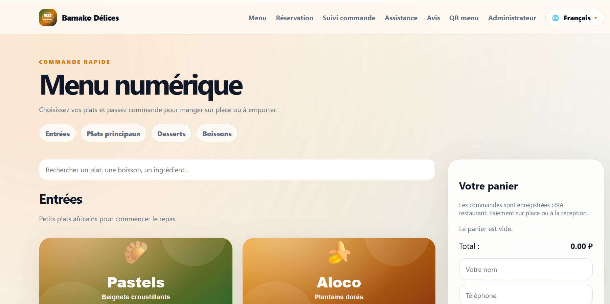
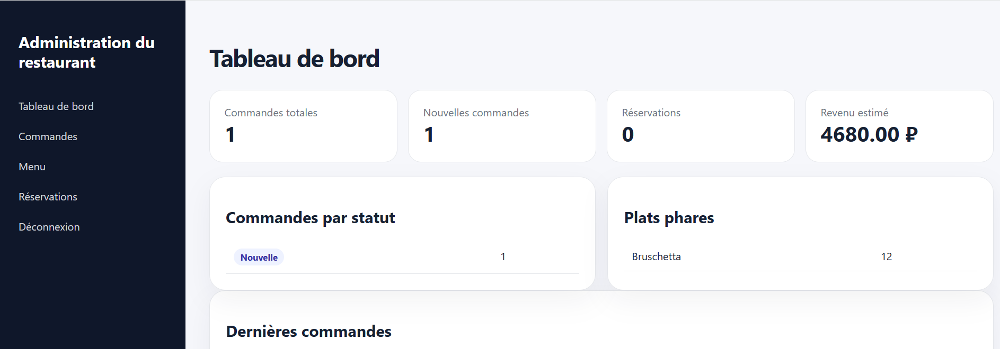
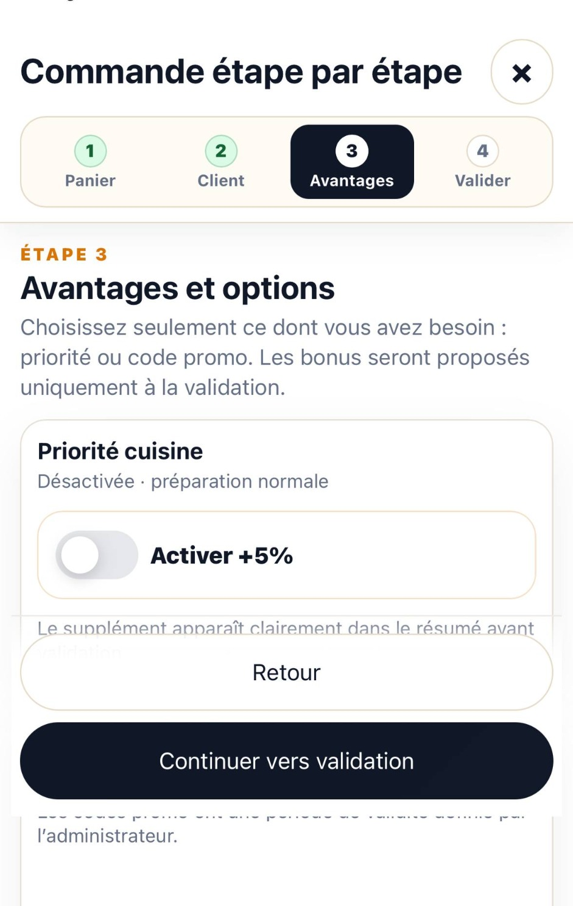
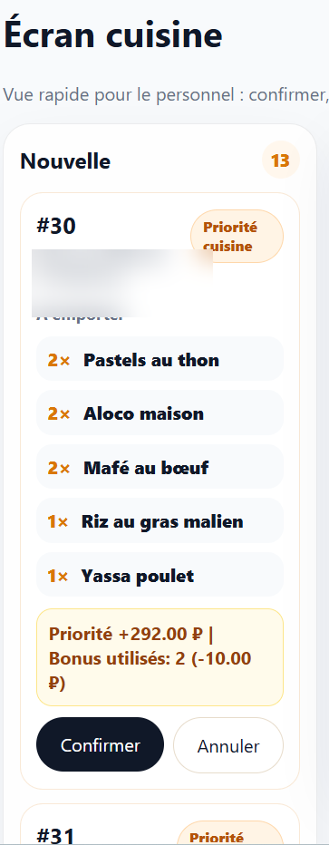
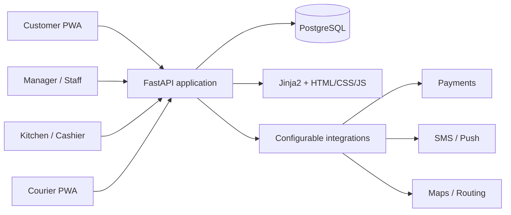

  

# Smart Restaurant Platform

**A production-oriented restaurant operations platform covering digital ordering, kitchen workflows, POS, reservations, loyalty, delivery management, and courier tracking.**

`FastAPI` · `PostgreSQL` · `Docker` · `PWA` · `5 languages` · `v1.0.2 stable`

[Live demo](https://bamako-delices-demo.onrender.com/menu) · [Product website](https://ousmane-tr25.github.io/smart-restaurant-platform-showcase/) · [Author profile](https://github.com/Ousmane-Tr25)

> This public repository is a product showcase. The complete commercial source code is maintained in a private repository and can be reviewed by recruiters or potential partners on request.

## Live demo

Open the public customer experience: **[bamako-delices-demo.onrender.com/menu](https://bamako-delices-demo.onrender.com/menu)**

The public deployment uses a dedicated cloud PostgreSQL database and HTTPS. Payment, SMS, and push integrations remain in demonstration mode. Testers should use fictitious names, phone numbers, and delivery addresses. The free hosting instance may need a short startup delay after inactivity.

## Product overview

Smart Restaurant Platform was designed as an end-to-end restaurant system rather than a simple online menu. It connects the customer experience with the operational workflows used by managers, kitchen staff, cashiers, and couriers.

### Customer experience

- Responsive digital menu with search, categories, favorites, and cart.
- Step-by-step checkout for dine-in, takeaway, QR-table ordering, and delivery.
- Promotions, loyalty bonuses, and optional kitchen-priority surcharge.
- Pay-at-restaurant and online-payment demo flows.
- Order tracking, receipts, order history, reservations, reviews, and support conversations.
- Installable PWA for Android and iPhone.
- French, Russian, English, Chinese, and Bambara interfaces.

### Restaurant operations

- Manager dashboard, live activity center, reports, costs, and margin analysis.
- Kitchen board with order stages and priority handling.
- Cashier, payment status, receipt printing, and kitchen tickets.
- Menu, stock, ingredients, recipes, suppliers, and expenses.
- Reservations, tables, and QR codes per table.
- Staff roles for manager, multi-purpose employee, kitchen, cashier, and courier.
- PostgreSQL backup, restore, data-integrity checks, account security, and audit logging.

### Delivery and courier workflow

- Courier acceptance and assignment protection.
- Ready → accepted → en route → delivered lifecycle.
- Courier route page with GPS updates and local simulation mode.
- Customer-facing delivery progress, remaining distance, and ETA.
- Links to Google Maps, Yandex Maps, and OpenStreetMap.

## Screenshots

### Digital menu

### Administration dashboard

### Mobile step-by-step checkout

  

### Mobile kitchen workflow

  

## Architecture

## Technical highlights

- Python 3.12, FastAPI, Jinja2, SQLAlchemy, and PostgreSQL.
- Docker and Docker Compose for reproducible local and production-style environments.
- Responsive HTML/CSS/JavaScript with an offline-capable service worker.
- Role-based access and separate operational interfaces.
- Versioned password hashing, login lockout, security headers, and audit trail.
- PostgreSQL dump verification, restore workflow, and integrity checks.
- Automated test and release gates before the official stable release.

## Quality status

The stable `v1.0.2` release completed the project release gate with:

- **91 automated tests passed**;
- **72 Jinja templates compiled**;
- health, readiness, version, security, reliability, and release-file audits;
- verified exclusion of environment files, database dumps, logs, and customer data from release archives.

## Technology stack

| Area | Technologies |
|---|---|
| Backend | Python 3.12, FastAPI, SQLAlchemy, Jinja2 |
| Database | PostgreSQL 16 |
| Frontend | HTML, CSS, JavaScript, PWA |
| Infrastructure | Docker, Docker Compose, Caddy-ready configuration |
| Quality | Pytest, static audits, release gates |
| Integrations | Configurable payment, SMS, push, maps, and routing providers |

## Commercial scope

The platform is designed for restaurant-specific deployment and customization. Payment, SMS, map, and push providers are configurable through environment variables, allowing each restaurant to own and fund its external service accounts.

The showcase does **not** include production credentials, customer records, API keys, database backups, or the complete private source code.

## Author

**Ousmane Traoré**  
Python / Data / ML-oriented developer building practical, production-structured applications.

- GitHub: [Ousmane-Tr25](https://github.com/Ousmane-Tr25)
- Full source review: available on request for recruitment or partnership discussions.

## License

Copyright © 2026 Ousmane Traoré. All rights reserved.  
This showcase and its visual assets may not be copied, redistributed, or used commercially without written authorization.
